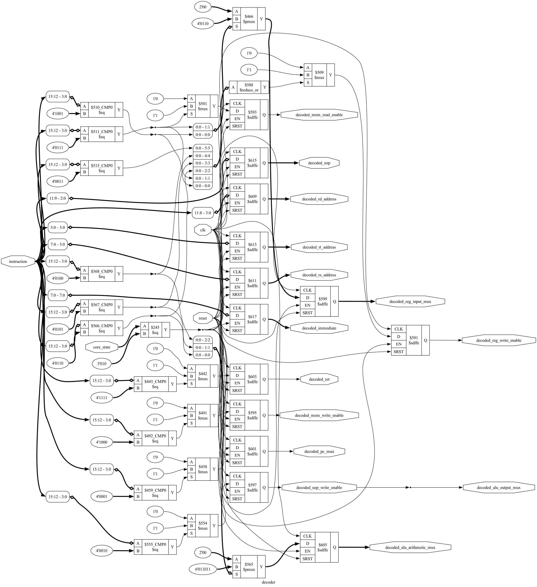

# TinyML Accelerator

This repository (Started at 2025-06-29) is my code output for learning FPGA and hardware acceleration of machine learning ***from scratch***.

<!-- 此仓库 (Started at 2025-06-29) 是本人学习 FPGA 和 机器学习的硬件加速 ***from scratch*** 的代码产出. -->

Relevant materials can be found at: [TinyML Project](https://marcobisky.github.io/tinyml/).

<!-- 有关资料见: [TinyML Project](https://marcobisky.github.io/tinyml/). -->

## What you need

We will use two FPGA development boards:

<!-- 我们会用两个 FPGA 开发板: -->

- [**iCESugar**](https://github.com/wuxx/icesugar): An open source FPGA development board based on iCE40UP5K, used to learn the principles of FPGA.
- **Arty A7-100T**: Used to run Google's [CFU-Playground](https://cfu-playground.readthedocs.io/en/latest/index.html) for learning how to accelerate machine learning models on FPGA.

<!-- - [**iCESugar**](https://github.com/wuxx/icesugar): iCE40UP5K 的开源 FPGA 开发板, 用来学习 FPGA 的原理.
- **Arty A7-100T**: 用来跑 Google 的 [CFU-Playground](https://cfu-playground.readthedocs.io/en/latest/index.html), 用来学习如何在 FPGA 上加速机器学习模型. -->

## Environment Setup for CFU-playground and iCESugar

[Env setup lang-cn](https://marcobisky.github.io/tinyml/env-setup.html)

## Generate Schematics for Visualization

```bash
# Manual for generating schematics
make -f schgen.mk help
# For example, you want to visualize `decoder` module in `./gpu`:
make -f schgen.mk module MODULE=decoder VSRC=./gpu
```

If you write your circuit in SystemVerilog (.sv), you can convert them to Verilog (.v) first using the open source tool [sv2v](https://github.com/zachjs/sv2v):

```bash
# Generate schematic for .sv, you should convert them to .v first
make -f schgen.mk convert VSRC=./gpu
# Then do this:
make -f schgen.mk module MODULE=decoder VSRC=./gpu
```

